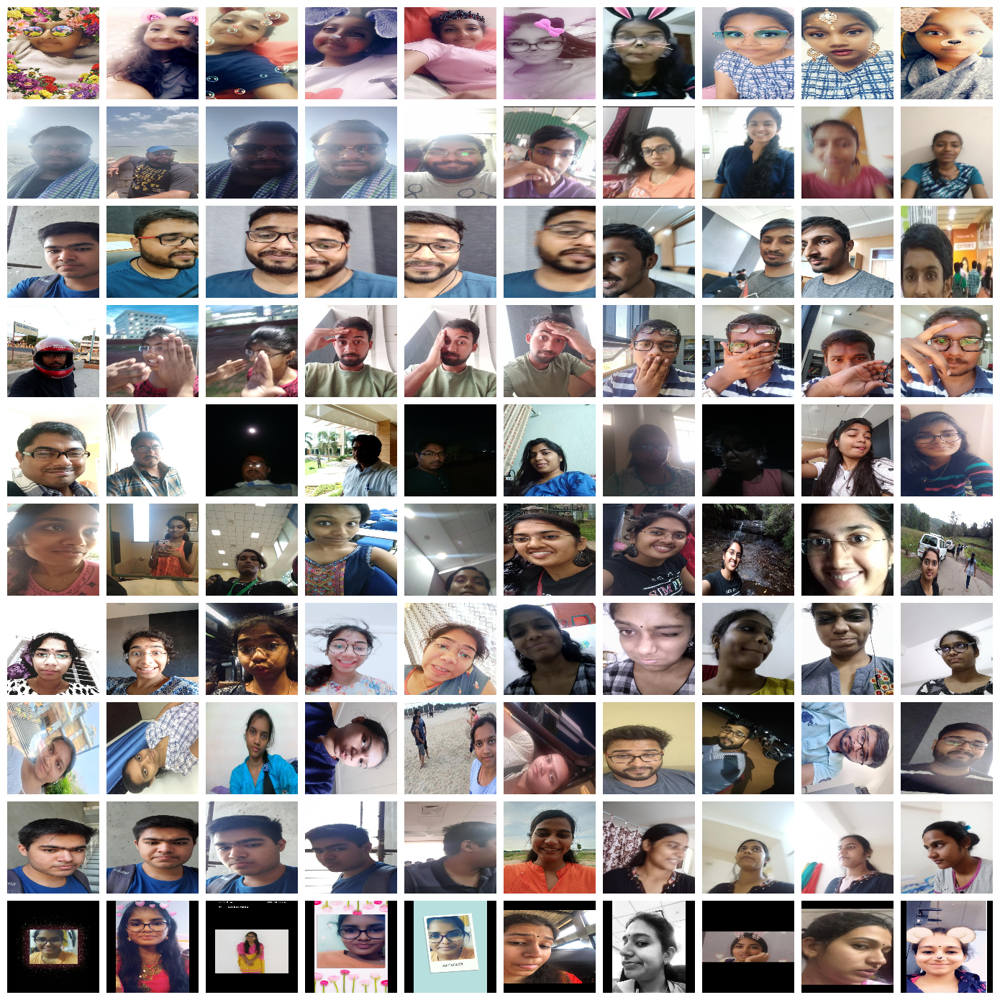

# Wild Selfie Dataset (WSD)

WSD: Wild Selfie Dataset for Face Recognition in Selfie Images
[[arXiv Preprint]](https://arxiv.org/pdf/2302.07245.pdf)

## Introduction
The Wild Selfie Dataset (WSD) contains the selfie images captured from the cameras of different smart phones, unlike existing datasets where most of the images are captured in controlled environment. The WSD dataset contains 45,424 images from 42 individuals (i.e., 24 female and 18 male subjects), which are divided into 40,862 training and 4,562 test images. The average number of images per subject is 1,082 with minimum and maximum number of images for any subject are 518 and 2,634, respectively. The proposed dataset consists of several challenges, including but not limited to augmented reality filtering, mirrored images, occlusion, illumination, scale, expressions, view-point, aspect ratio, blur, partial faces, rotation, and alignment.

## Download WSD Dataset
In order to get the dataset, kindly fill the [[License Form]](https://github.com/shivram1987/WildSelfieDataset/LICENSE_AGREEMENT_WildSelfieDataset.pdf) and send to srdubey@iiita.ac.in. Note that the license form must be filled by a faculty who is Lab Incharge/Head of Department/Head of Institute. The form signed by a student will not be considered. The download link will be provided after verification of the license form. The annotation files are provided in this repo.

## Citation
Any work made public, whatever the form, based directly or indirectly on any part of this Dataset has to include the following reference:

L. Kumarapu, S. R. Dubey, S. Mukherjee, P. Mohan, S. P. Vinnakoti, and S. Karthikeya, "WSD: Wild Selfie Dataset for Face Recognition in Selfie Images", arXiv preprint arXiv:2302.07245, 2023.
